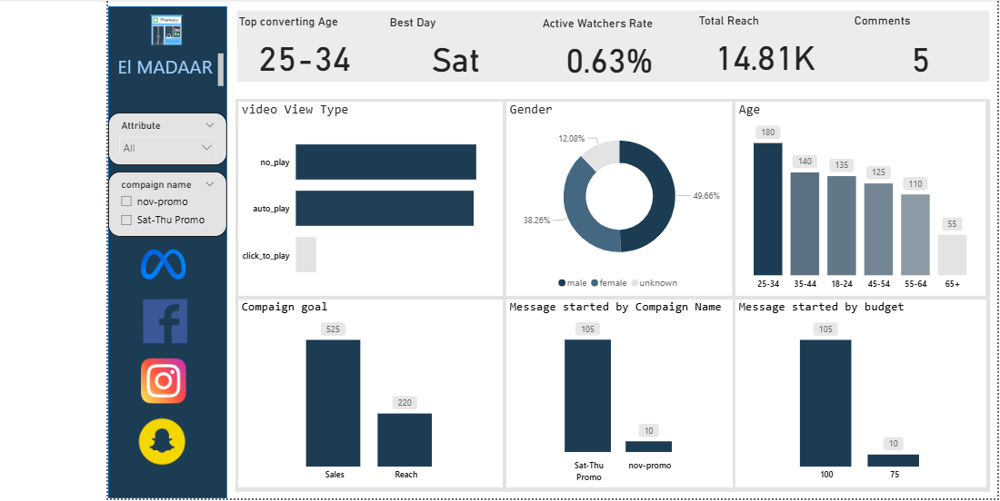
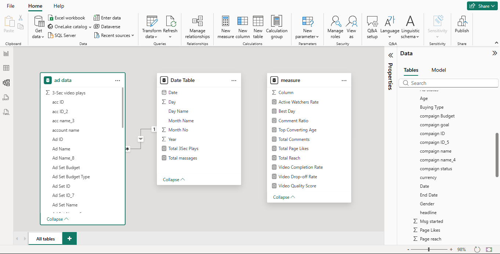

Marketing Ad Analysis README

# 📱 Marketing Ad Analysis | Power BI Dashboard

## 🎯 Project Overview

An interactive Power BI dashboard analyzing social media advertising campaign performance for "El MADAAR" across Meta platforms (Facebook, Instagram, Snapchat). The dashboard provides comprehensive insights into campaign effectiveness, audience demographics, engagement metrics, and conversion optimization.

## 🛠️ Tools Used

- **Power BI Desktop** — Dashboard creation and interactive visualizations
- **Power Query** — Data cleaning and transformation
- **DAX** — Creating custom measures and calculated columns
- **Meta Ads Manager Data** — Campaign performance metrics from social media platforms

## ✨ Key Features

- **KPI Cards** — Track Top Converting Age (25-34), Best Day (Saturday), Active Watchers Rate (0.63%), Total Reach (14.81K), and Comments (5)
- **Video View Analysis** — Breakdown by view type (no_play, auto_play, click_to_play)
- **Demographic Insights** — Gender distribution (Male 49.66%, Female 38.26%, Unknown 12.08%) and Age segmentation
- **Campaign Performance** — Goals tracking (Sales: 325, Reach: 220)
- **Message Analytics** — Campaign message performance by name and budget
- **Platform Integration** — Multi-platform tracking (Meta, Facebook, Instagram, Snapchat)

## 💡 Key Insights

Through analysis of marketing campaign data, the dashboard reveals:

- **Optimal Target Audience:** 25-34 age group shows highest conversion rate
- **Best Engagement Day:** Saturday delivers peak performance with highest active watchers
- **Total Campaign Reach:** 14.81K users reached across all platforms
- **Engagement Rate:** 0.63% active watchers rate demonstrating audience interaction
- **Social Proof:** 5 total comments indicating user engagement
- **Gender Distribution:** 
  - Male audience: 49.66%
  - Female audience: 38.26%
  - Unknown: 12.08%
- **Age Demographics:** Strongest presence in 25-34 bracket (180), followed by 35-44 (140), 18-24 (135), 45-54 (125), 55-64 (110), and 65+ (55)
- **Video Performance:** Multiple view types tracked including auto-play and click-to-play engagement
- **Campaign Goals:** Sales-focused campaign achieved 325 conversions vs 220 reach-focused results
- **Budget Allocation:** Message performance tracked across campaign budgets (100 vs 75 budget allocation)
- **Campaign Types:** "Sat-Thu Promo" campaign outperformed "nov-promo" with 105 vs 10 messages started

## 📸 Dashboard Screenshots

### Main Marketing Dashboard
*Interactive view showing KPIs, demographics, video view types, campaign goals, and message performance*

### Data Model & Relationships
*Power BI data model showing relationships between ad data, date table, and measure tables*

## 🚀 How to Use

1. Download and install Microsoft Power BI Desktop from: https://powerbi.microsoft.com/desktop/
2. Clone the project:

git clone https://github.com/eslamrezk14/Marketing-Ad-Analysis.git

3. Open the Power BI dashboard file in Power BI Desktop
4. Use filters to analyze campaigns by:
   - Campaign name (nov-promo, Sat-Thu Promo)
   - Attribute (All)
   - Time period and platform

## 📊 Key Metrics Tracked

| Metric | Value | Description |
|--------|-------|-------------|
| Top Converting Age | 25-34 | Most responsive age demographic |
| Best Day | Saturday | Highest engagement day |
| Active Watchers Rate | 0.63% | Video engagement percentage |
| Total Reach | 14.81K | Total users reached |
| Total Comments | 5 | User engagement indicator |
| Sales Goal | 325 | Sales campaign conversions |
| Reach Goal | 220 | Reach campaign performance |
| Male Audience | 49.66% | Gender distribution |
| Female Audience | 38.26% | Gender distribution |

## 📂 Project Structure

Marketing-Ad-Analysis/
│
├── Power BI Dashboard.pbix      # Main Power BI dashboard file
├── README.md                     # Project documentation (this file)
└── images/                       # Dashboard screenshots
    ├── final-project.jpg
    └── relation-screenshot.jpg

## 🎓 Skills Demonstrated

- Data modeling with multiple tables and relationships
- Advanced DAX measures for campaign analytics
- Demographic analysis and segmentation
- Interactive dashboard design with brand theming
- Social media metrics tracking and visualization
- Campaign performance optimization
- Multi-platform data integration
- KPI card design and metric visualization
- Time-based analysis (day of week, campaign periods)

## 📈 Data Model

The dashboard uses a comprehensive data model including:

- **ad data table** — Campaign performance metrics (3-Sec video plays, account details, ad information, budgets)
- **Date Table** — Time intelligence with Date, Day, Day Name, Month Name, Month No, Year
- **measure table** — Custom DAX calculations including Active Watchers Rate, Best Day, Comment Ratio, Top Converting Age, Total Comments, Total Page Likes, Total Reach, Video Completion Rate, Video Drop-off Rate, Video Quality Score

## 🔍 Campaign Analysis Features

- **Video View Types** — Track no_play, auto_play, and click_to_play engagement
- **Gender Targeting** — Analyze performance across male, female, and unknown demographics
- **Age Segmentation** — Detailed breakdown across 6 age groups (18-24, 25-34, 35-44, 45-54, 55-64, 65+)
- **Campaign Goals** — Compare Sales vs Reach campaign effectiveness
- **Message Performance** — Track message starts by campaign name and budget allocation
- **Platform Coverage** — Meta, Facebook, Instagram, and Snapchat integration

## 📬 Contact Information

**Eslam Rezk**  
*Data Analyst*

- **GitHub:** https://github.com/eslamrezk14
- **LinkedIn:** [Add your LinkedIn profile URL]
- **Email:** [Add your email address]

---

**⭐ If you found this project helpful, please consider giving it a star!**

**Note:** Dashboard screenshots are included in the `images/` folder. Update your contact information above.
